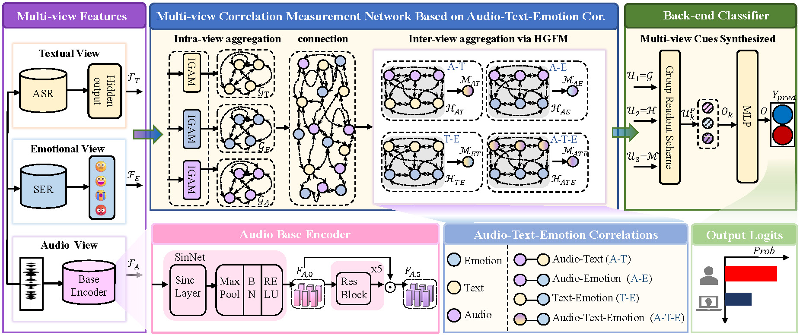

# Audio Multi-view Spoofing Detection Framework (AMSDF)

**Authors**: [Junyan Wu](https://www.researchgate.net/profile/Wu-Junyan-5/research), Qilin Yin, Ziqi Sheng, [Wei Lu (Corresponding author)](https://cse.sysu.edu.cn/content/2461), Jiwu Huang, Bin Li.


Audio Multi-view Spoofing Detection Framework (**AMSDF**) is designed to capture both intra-view and inter-view spoofing cues by measuring correlations within audio-emotion-text features. [PaperLink](https://ieeexplore.ieee.org/document/10605761)




## 1. Setup

It is recommended that you install Python 3.8 or higher. We followed the installation setup in this project [SSL_Anti-spoofing](https://github.com/TakHemlata/SSL_Anti-spoofing), which is presented as follows:

```bash
conda create -n SSL python=3.8 numpy=1.23.5
conda activate SSL
pip install torch==1.8.1+cu111 torchvision==0.9.1+cu111 torchaudio==0.8.1 -f https://download.pytorch.org/whl/torch_stable.html
--------------install fairseq--------------
git clone https://github.com/TakHemlata/SSL_Anti-spoofing.git
cd fairseq-a54021305d6b3c4c5959ac9395135f63202db8f1
pip install --editable ./
--------------install requirement--------------
git clone https://github.com/ItzJuny/AMSDF24.git
pip install -r requirement.txt
```


## 2. For Testing 
We provide three checkpoints (M1-M3) and corresponding scores, which can be downloaded from [GoogleDrive](https://drive.google.com/drive/folders/1XjVZ6K12KdC3Xm2Ri5l8FYpUJf5IlqPa?usp=sharing). M1-M3 were trained under different seeds, with labels for 'real' audio and 'fake' audio set to '0' and '1', respectively. 


### 2.1 Run 🚀

  - Producing scores for a single dataset:
  ```python
  python main_AMSDF.py --eval --ename asvs2019la --emodel './checkpoint/M1.pth' -tbs 64 --score_path './scores'
  ```
  
  - Producing scores for all datasets:
  
  ```python
  python inference_all_dataset.py --emodel './checkpoint/M1.pth' -bs 64 --score_path './scores'
  ```


  - Evaluating one checkpoint from the score path:
  ```python
  python eval_from_score_path.py --score_path ./scores/M1
  ```

  - Evaluating all checkpoints from the score path:
  ```python
  python eval_from_score_path.py --score_path ./scores
  python eval_from_score_path.py --score_path ./scores_vote
  ```

### 2.2 Results in terms of best/average/vote EERs
|      Evaluation                     | Dataset     | M1 | M2 | M3 | $EER_{best}$| $EER_{avg}$| $EER_{vote}$|
|---------------------------|-------------|-----------|-----------|-----------|--------------|-------------|-------------|
| Intra-dataset   | ASVS2019LA  |   0.30        |     0.16      |   0.48        |    0.16          |     0.31        |     0.16        |
| Robust-dataset  | ASVS2021LA  |   2.00        |    2.66       |   6.21        |       2.00       |   3.62          |     2.40        |
|                           | ASVS2021DF  |   3.82        |   8.05        |   6.30        |   3.82           |    6.06         |     4.10        |
| Cross-dataset   | ASVS2015Eval    |   0.16        |     0.12       |    0.12       |      0.12        |     0.13        |     0.11        |
|                           | ASVS2015Dev  |   0.14        |   0.22        |   0.06        |    0.06          |   0.14          |     0.06        |
|                           | FakeorReal  |   11.44        |   8.91        |    4.55       |      4.55        |     8.30        |     5.39        |
|                           | FakeAVCeleb |   18.16        |   40.11        |     8.03      |     8.03         |    22.10         |     6.80        |
|                           | IntheWild   |   15.45        |   29.22        |   9.50        |      9.50        |    18.06         |     9.03        |
  
**Note: The vote results by applying softmax to scores are more common to represent the detection performance, which was not included in the paper.**


## 3. For Training
### 3.1 Multi-view Feature Extraction
You can try different multi-view pre-trained models within this framework.

#### Textual-view pipeline
You can download this pre-trained model from [here](https://dl.fbaipublicfiles.com/fairseq/wav2vec/xlsr2_300m.pt), and put it in this folder `./pretrained_models`.
#### Emotional-view pipeline
We trained this model following [this project](https://github.com/Chien-Hung/Speech-Emotion-Recognition). You can download this pretrained model from [GoogleDrive]((https://drive.google.com/drive/folders/1XjVZ6K12KdC3Xm2Ri5l8FYpUJf5IlqPa?usp=sharing)), and put it on this folder `./pretrained_models`.

#### Audio-view pipeline
There is no need for an audio-view pre-trained model, as it aims to detect spoofing and can be trained from scratch.

### 3.2 Run 🚀
Please ensure you have downloaded all development datasets listed in the evaluation table, as we use three development datasets (not just ASVS2019LA) to select the best model.

```
python main_AMSDF.py -bs 12 -tbs 64 --num_epoch 15 --seed 1234 --save
python main_AMSDF.py -bs 12 -tbs 64 --num_epoch 15 --seed 42 --save
```


## Acknowledgements
This repository thanks several open source projects: [AASIST[1]](https://github.com/clovaai/aasist), [SSLAS[2]](https://github.com/TakHemlata/SSL_Anti-spoofing), [SER[3]](https://github.com/Chien-Hung/Speech-Emotion-Recognition), [Wav2vec[4]](https://github.com/facebookresearch/fairseq/tree/main/examples/wav2vec/xlsr). 

```
@INPROCEEDINGS{Jung2021AASIST,
  author={Jung, Jee-weon and Heo, Hee-Soo and Tak, Hemlata and Shim, Hye-jin and Chung, Joon Son and Lee, Bong-Jin and Yu, Ha-Jin and Evans, Nicholas},
  booktitle={arXiv preprint arXiv:2110.01200}, 
  title={AASIST: Audio Anti-Spoofing using Integrated Spectro-Temporal Graph Attention Networks}, 
  year={2021}}
```
```
@inproceedings{tak2022automatic,
  title={Automatic speaker verification spoofing and deepfake detection using wav2vec 2.0 and data augmentation},
  author={Tak, Hemlata and Todisco, Massimiliano and Wang, Xin and Jung, Jee-weon and Yamagishi, Junichi and Evans, Nicholas},
  booktitle={The Speaker and Language Recognition Workshop},
  year={2022}
}
```

```
@article{chen20183,
  title={3-D convolutional recurrent neural networks with attention model for speech emotion recognition},
  author={Chen, Mingyi and He, Xuanji and Yang, Jing and Zhang, Han},
  journal={IEEE Signal Processing Letters},
  volume={25},
  number={10},
  pages={1440--1444},
  year={2018},
  publisher={IEEE}
}
```
```
@article{babu2021xlsr,
      title={XLS-R: Self-supervised Cross-lingual Speech Representation Learning at Scale}, 
      author={Arun Babu and Changhan Wang and Andros Tjandra and Kushal Lakhotia and Qiantong Xu and Naman Goyal and Kritika Singh and Patrick von Platen and Yatharth Saraf and Juan Pino and Alexei Baevski and Alexis Conneau and Michael Auli},
      year={2021},
      volume={abs/2111.09296},
      journal={arXiv},
}
```

## Citation
Kindly cite our work if you find it useful.


```
@ARTICLE{wu2024audio,
  author={Wu, Junyan and Yin, Qilin and Sheng, Ziqi and Lu, Wei and Huang, Jiwu and Li, Bin},
  journal={IEEE Transactions on Information Forensics and Security}, 
  title={Audio Multi-view Spoofing Detection Framework Based on Audio-Text-Emotion Correlations}, 
  year={2024},
  volume={19},
  number={},
  pages={7133-7146},
  doi={10.1109/TIFS.2024.3431888}}
```
